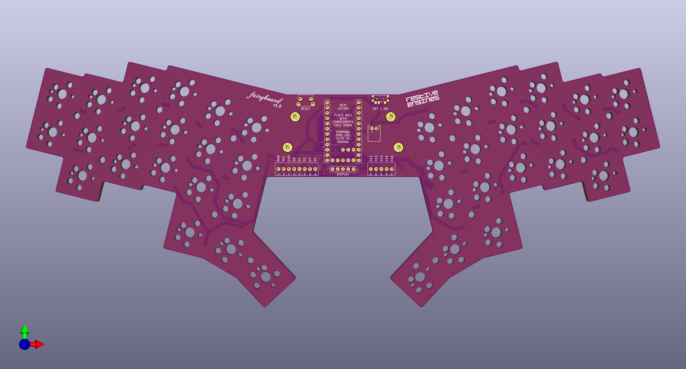
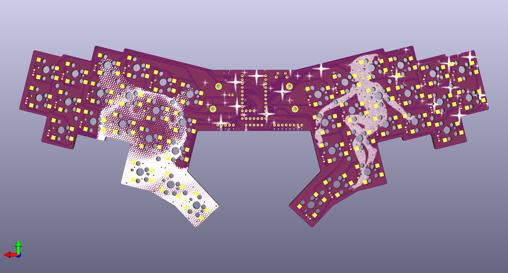

# fairyboard

## Introduction

The fairyboard is a monoblock split columnar-staggered keyboard inspired by boards such as the corne, Lily58, Le Chiffre, and others. It is designed based on my own finger positions, with a thumb cluster that is comfortable for my smaller hands while resting in what I consider a neutral position. A monoblock design has been chosen easy portability and setup.

This is an iteration on my previous keyboard, [shockboard](shockboard.md). The changes include:

* a larger angle between the two halves (10mm -> 14mm)
* a larger distance between the two halves
* removed number row
* adjusted column stagger
* tighter thumb cluster
* rotated the choc v1 footprint relative to the MX one
* added choc v2 compatibility
* removed through-hole diode option
* compatibility with nice!view
* extendable with terminal blocks, headers, or through direct soldering to add future pointing devices

## Manufacturing

### PCB manufacture

See `pcbs/fairyboard_v1/fairyboard_v1.zip` for files containing pcb fabrication files for each keyboard revision. This zip file can be uploaded to JLCPCB for manufacturing.

## Assembly

### PCB BOM

* 1x fairyboard PCB
* 1x pro-micro, nice!nano, or elite-c pin compatible microcontroller (nice!nano recommended)
* Mill Max low profile sockets for your micricontroller (see [How do I socket a microcontroller?](https://docs.splitkb.com/hc/en-us/articles/360011263059-How-do-I-socket-a-microcontroller)) [[link](https://splitkb.com/products/mill-max-low-profile-sockets?variant=47060695646555)]
* 1x SKHLLCA010 footprint compatible button (side push) [[link](https://splitkb.com/products/reset-buttons?variant=42291963560195)]
* 1x MSK12C02 footprint compatible switch [[link](https://splitkb.com/products/wireless-controller-expansion-bundle?variant=42344261288195)]
* 40x 1N4148W diodes (SOD-123 surface mount or through-hole) [[link](https://splitkb.com/products/smd-diodes?variant=42283984027907)]
* 40x CPG151101S11 Kailh hotswap sockets for MX switches or CPG135001S30 Kailh hotswap sockets for choc switches [[link](https://keycapsss.com/keyboard-parts/parts/49/kailh-hotswap-pcb-sockets-10-pcs?number=KC10019_CHOC)]
* 40x MX or choc (v1 or v2) compatible keyboard switches [[link](https://splitkb.com/products/ambients-kailh-low-profile-choc-switches?variant=48116169277787)]
* 40x MX or choc (v1 or v2) compatible keycaps (you can [print your own](../keycaps))
* 1x nice!view display with male and female header pins (optional)
* 1x 301230 LiPo battery with 2-pin JST connector (optional for wireless microcontroller)
* 1x JST 2-pin jack (optional for wireless microcontroller) [[link](https://splitkb.com/products/wireless-controller-expansion-bundle?variant=42344261288195)]
* 1x 8-pin 2.54mm pitch terminal block (optional) [[link](https://nl.rs-online.com/web/p/pcb-terminal-blocks/2872357)]
* 1x 5-pin 2.54mm pitch terminal block (optional)

### PCB assembly

1. Solder the diodes to the back of the PCB (the side with the picture of the cat on it).
2. Solder the Kailh hotswap sockets to the back of the PCB. The hotswap sockets should be oriented such that the bumps fit through the holes and the metal contacts rest on the solder pads.
3. Solder Mill Max low profile female headers to the top side of the PCB in the middle for the microcontroller pins. See [here](https://docs.splitkb.com/hc/en-us/articles/360011263059-How-do-I-socket-a-microcontroller).
4. Socket your microcontroller such that the PCB will lie with its components face-down when attached to the PCB. The microcontroller will be attached from the top of the pcb, so match up the pin labels with those you see on the silkscreen there. See [here](https://docs.splitkb.com/hc/en-us/articles/360011263059-How-do-I-socket-a-microcontroller).
5. Solder the SKHLLCA010 button (reset button) to the top of the PCB to the left of the microcontroller.
6. Solder the MSK12C02 switch (power switch) to the top right corner of the PCB.
7. (optional) Solder the 2-pin JST connector to the top side of the board to the right of the microcontroller.
8. (optional) Solder the female headers for the OLED screen to the top side of the board below the microcontroller.
9. (optional) Install the battery into the JST connector and lay in down between the Mill Max headers where the microcontroller will be placed. Make sure that the red battery lead is connected to the left side of the JST jack (marked +) and the black lead is connected to the right side of the JST jack (marked -).
10. Insert the socketed microcontroller with the components facing away from you to the Mill Max sockets.
11. (optional) Insert the display with the pins on the bottom into the female headers.
12. (optional) Solder the terminal blocks to the holes to the bottom left and bottom right of the microcontroller.

### Case BOM

* 1x fairyboard case
* 12x 5mm (for choc) or 8mm (for MX) m2 spacers [[link](https://keycapsss.com/keyboard-parts/parts/62/m2-standoff-spacer-brass-round-10pcs?number=KC10031_5MM)]
* 24x 5mm m2 screws
* 4x 7mm m2 spacers for display cover (optional) [[link](https://keycapsss.com/keyboard-parts/parts/62/m2-standoff-spacer-brass-round-10pcs?number=KC10031_7mm)]
* 8x 5mm m2 screws for display cover (optional)

### Case Assembly

TODO

## Ordering

splitkb.com:

* 1x https://splitkb.com/products/m2-screws?variant=42396986999043
* 1x https://splitkb.com/products/smd-diodes?variant=42283984027907
* 1x https://splitkb.com/products/reset-buttons?variant=42291963560195
* 1x https://splitkb.com/products/wireless-controller-expansion-bundle?variant=42344261288195
* 2x https://splitkb.com/products/mill-max-low-profile-sockets?variant=47060695646555
* 1x https://splitkb.com/products/ambients-kailh-low-profile-choc-switches?variant=48116169277787

keycapsss.com:

* 5x https://keycapsss.com/keyboard-parts/parts/49/kailh-hotswap-pcb-sockets-10-pcs?number=KC10019_CHOC
* 1x https://keycapsss.com/keyboard-parts/parts/211/glidepoint-cirque-trackpad-tm040040-tm035035?number=KC10166_40-C
* 2x https://keycapsss.com/keyboard-parts/parts/62/m2-standoff-spacer-brass-round-10pcs?number=KC10031_5MM
* 2x https://keycapsss.com/keyboard-parts/parts/62/m2-standoff-spacer-brass-round-10pcs?number=KC10031_7mm
